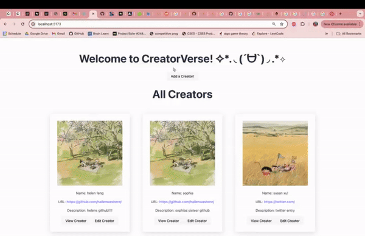

# WEB103 Prework - *👉🏿 CreatorVerse*

Submitted by: **👉🏿 Helen Feng**

About this web app: **👉🏿 CreatorVerse is a simple web application for users to view creators that exist in the associated Supabase database. Users can also create, view, edit, and delete creators on the site!**

Time spent: **👉🏿 6** hours

## Required Features

The following **required** functionality is completed:

<!-- 👉🏿👉🏿👉🏿 Make sure to check off completed functionality below -->
- [x] **A logical component structure in React is used to create the frontend of the app**
- [x] **At least five content creators are displayed on the homepage of the app**
- [x] **Each content creator item includes their name, a link to their channel/page, and a short description of their content**
- [?] **API calls use the async/await design pattern via Axios or fetch()**
  - note that in the WEB103 Preword Slack, when someone asked if they were supposed to use Axios or fetch(), a user named Anuj Adulla sent "I had already submitted a request to see if this could be updated but I never received a response. Your implementation does work though, my prework for Web103 was accepted and I used the same code as you, I didn't use any other APIs or Axios". 
  - Since the prework required Supabase to be used, with comes with its own API calls, I did not find it necessary to use Axios/fetch()
- [x] **Clicking on a content creator item takes the user to their details page, which includes their name, url, and description**
- [x] **Each content creator has their own unique URL**- [ ] **The user can edit a content creator to change their name, url, or description**
- [x] **The user can delete a content creator**
- [x] **The user can add a new content creator by entering a name, url, or description and then it is displayed on the homepage**

The following **optional** features are implemented:

- [ ] Picocss is used to style HTML elements
  - I did not use Picocss but I manually styled some elements with vanilla CSS for simplicity
- [x] The content creator items are displayed in a creative format, like cards instead of a list
- [x] An image of each content creator is shown on their content creator card

The following **additional** features are implemented:

* [x] List anything else that you added to improve the site's functionality!
  - alerts to tell the user that an API request is running
  - a loading message before data is loaded from the database onto the frontend

## Video Walkthrough

Here's a walkthrough of implemented required features:

👉🏿

<!-- Replace this with whatever GIF tool you used! -->
GIF created with ...  👉🏿 MacOS Screen Recording and [EZgif](https://ezgif.com/)
<!-- Recommended tools:
[Kap](https://getkap.co/) for macOS
[ScreenToGif](https://www.screentogif.com/) for Windows
[peek](https://github.com/phw/peek) for Linux. -->

## Notes

It was my first time developing a web app with TypeScript instead of JavaScript, so I learned a lot about what kind of errors one might encounter without considering proper type declarations. I realized how much clearer my project was once I understood the types of the different data/props I was using!
## License

Copyright [👉🏿 2024] [👉🏿 Helen Feng]

Licensed under the Apache License, Version 2.0 (the "License"); you may not use this file except in compliance with the License. You may obtain a copy of the License at

> http://www.apache.org/licenses/LICENSE-2.0

Unless required by applicable law or agreed to in writing, software distributed under the License is distributed on an "AS IS" BASIS, WITHOUT WARRANTIES OR CONDITIONS OF ANY KIND, either express or implied. See the License for the specific language governing permissions and limitations under the License.